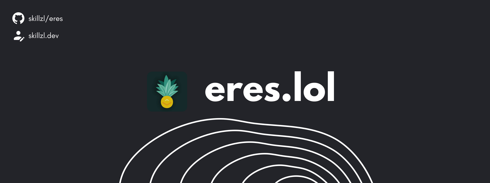

<p align="center">
    <a href="https://eres.lol" >
        
    </a>
</p>

🍍 A multi-purpose Discord client written in Javascript with 42 commands and a highly optimised web application with control over the application's settings. Eres is running on over 34 servers, we invite you to try it out and hope you enjoy it!

<p align="center"> 
  <a href="https://ko-fi.com/eres_fun" target="_blank">
    
  </a>
</p>

### 📂 Content
- [🌐 Deployment \& Features](#-deployment--features)
- [⌨️ Node start guide](#️-node-start-guide)
- [🖼️ Dashboard UI](#️-dashboard-ui)
- [🚀 Envoirement settings](#-envoirement-settings)
- [📈 Analytics](#-analytics)
- [😃 Emojis](#-emojis)
- [🔐 License](#-license)
- [🙋‍♂️ Contributors](#️-contributors)

## 🌐 Deployment & Features

Deployment support is not here yet! This repository is only for github imigration purposes.

- ☑️ Modular features with optional congifuration.
- ☑️ Experience system with levels and xp.
- ☑️ Popular canva design for rank and profile command.
- ☑️ Web application (dashboard) for optional configuration settings.
- ☑️ Multi-lingual support (available languages: English, Romanian).
- ☑️ Modern tehnologies for web app (nodejs, express, mongodb, tailwindcss, etc).
- ☑️ Music player for mass-usage (DJ Role setting on dashboard).

## ⌨️ Node start guide

```
git clone https://github.com/skillzl/eres
cd eres-main

npm install
node deploy (before running bot.js, so the slash commands can be loaded) 

npn run start [cls && node bot.js] or nodemon
```

## 🖼️ Dashboard UI


> **Tip**: Visit this repository to check out the latest version available.

## 🚀 Envoirement settings

```
## Discord Application Token
TOKEN=

## Mongoose Connection String
MONGO_URL=

## Discord Application Unique Identifier
CLIENT_ID=

## Dicord Application Secret Key => (used for dashboard authentication)
CLIENT_SECRET=

## Listening Port for web-server
PORT= (e.g: 3000)

## Callback Url for web-server => (also applied in discord.com/developers settings)
CALLBACK_URL= (e.g: http://localhost:3000/login)

## Support server Url
SUPPORT_SERVER=

## Unique identifier developer
DEVELOPER_ID=

## Unique identifier webhook for bug reports
WEBHOOK_ID=

## Unique token webhook for bug reports
WEBHOOK_TOKEN= 

## Analytics unique identifier (for analytics)
ANALYTICS_ID=

## Domain
DOMAIN= (e.g: localhost:3000 => if used locally)

## api.skillzl.dev unique key (visit api.skillzl.dev for key)
SKILLZL_API_KEY=

## Custom youtube cookie (for 419 rate limits)
YOUTUBE_COOKIE=


## api.eres.lol unique key (visit api.eres.lol for key)
API_ERES_KEY=

## GitHub Personal Token => (used for github integration /admin/panel)
GITHUB_TOKEN=

## Replicate API Key (replicate.com for key)
REPLICATE_API_KEY=
```

> **Note**: Envoirement settings need to be in a ".env" file.

## 📈 Analytics

Use this feature to know exactly how many people are using the bot.
This feature requires the `ANALYTICS_ID` to be set. To get your `_id` from the mangoose database, follow this tutorial I made real quick! 

[Analytics Tutorial](./ANALYTICS.md)

## 😃 Emojis

If you want to use custom emojis, you can do it here.
Eres project emojis are stored in assets: [assets/emojis](./assets/emojis/) (import them to your Discord server)
To change emojis you can do it here: [functions/Emojis](./functions/Emojis.js) (currently those emojis are from `Eres - 🍍` Discord server, so you need to change with yours)
## 🔐 License

This project is licensed under the `Apache License 2.0 License` - see the [LICENSE](https://github.com/skillzl/eres/blob/main/LICENSE) file for details.

## 🙋‍♂️ Contributors
Don't hesitate to make a pull request if you have any suggestions, bugs or just want to add more features.

<a href="https://github.com/skillzl/eres/graphs/contributors">
  
</a>
