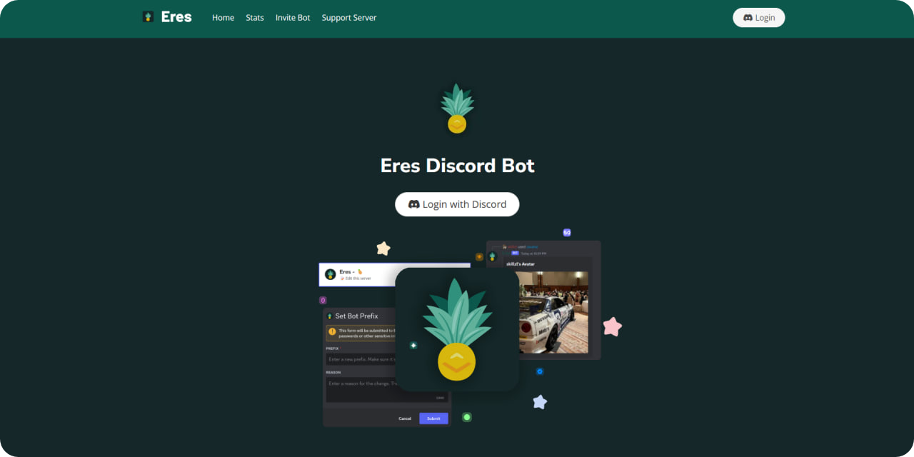

>  eres<br/> author: skillzl

  
🍍 Complete journey rewriting the original chrlwv source to discord.js@v14.1.1!

## Deployment & Features
Deployment support is not here yet! This repository is only for github imigration purposes.

Current version it is not available for production deployment.

> **Note**
> Application is not intended to be used in production environments.

- Modular features with optional congifuration.
- Experience system with levels and xp.
- Web application (dashboard) for optional configuration settings.
## Node start guide

```
git clone https://github.com/skillzl/eres
cd eres-main

npm install
npn run start [cls && node bot.js] or nodemon
```
## Dashboard


> **Release**: No estimated time of release, this may be changed later.
> **Tip**: Visit this repository to check out the latest version. 
## Envoirement settings

```
## Discord Application Token
TOKEN=

## Mongoose Connection String
MONGO_URL=

## Discord Application Unique Identifier
CLIENT_ID=

## Dicord Application Secret Key => (used for dashboard authentication)
CLIENT_SECRET=

## Listening Port for web-server
PORT= (e.g: 3000)

## Callback Url for web-server => (also applied in discord.com/developers settings)
CALLBACK_URL= (e.g: http://localhost:3000/login)

## Support server Url
SUPPORT_SERVER=

## Unique identifier developer
DEVELOPER_ID=
```
> **Note**
 Envoirement settings can be changed here: [.env.example](https://github.com/skillzl/eres/blob/main/.env.example)
## License
This project is licensed under the Apache License 2.0 License - see the [LICENSE](https://github.com/skillzl/eres/blob/main/LICENSE) file for details.
